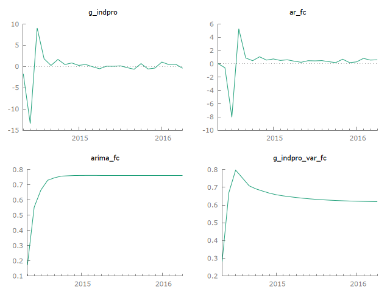
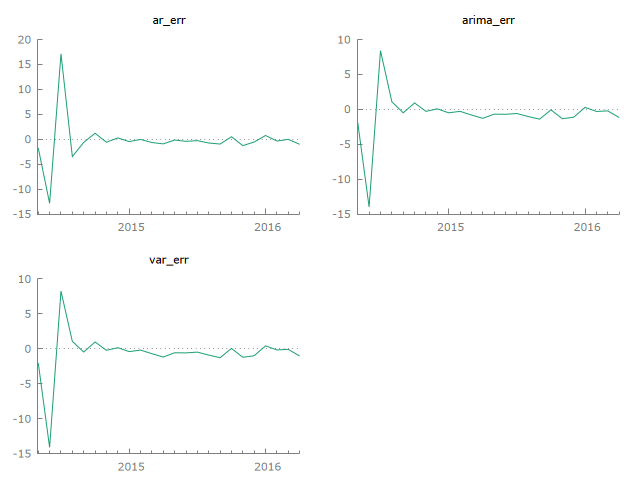

# Gretl MCP

[](https://www.npmjs.com/package/gretl-mcp)
[](https://github.com/OndrejLapes/GretlMCP)

Built for AI agents: run Hansl/Gretl workflows, get graph screenshots, and view
calculations in the real Gretl GUI.

It lets MCP clients run Gretl/Hansl scripts, raw Gretl command lines, existing
`.inp` files, package operations, package builds, help lookups, dataset
summaries, and OLS models. The generic `gretl_run_script` tool is the main path
for prompt-generated Gretl workflows: the client writes Hansl from the user's
request, runs it through Gretl, and returns Gretl's output plus generated
artifacts.

Keywords: Claude Gretl, MCP econometrics, Hansl AI, Gretl GUI automation.

## Key Features

- Scriptable Gretl control through `gretlcli`.
- GUI-first workflow tools that launch `gretl.exe` and fail if the GUI did not open.
- Capability discovery for Gretl commands, functions, and package commands.
- Generic execution tools for full Hansl scripts, command lists, and local
  `.inp` script files.
- Package tools for `pkg` and `makepkg` workflows from the Gretl Function
  Package Guide.
- High-level tools for version checks, command help, dataset summaries, and OLS.
- Stdio transport, compatible with common MCP clients.
- Safe defaults for arbitrary scripts, with documented escape hatches.

## Requirements

- Node.js 20 or newer.
- Gretl 2026b or newer with `gretlcli` available.
- An MCP client that supports stdio servers.

## Getting Started

One-command install (after npm publish):

```powershell
npx -y gretl-mcp@latest --version
```

Local install from GitHub:

```powershell
git clone https://github.com/OndrejLapes/GretlMCP.git
cd GretlMCP
npm install
npm run build
```

Then point your MCP client at the built server:

```json
{
  "mcpServers": {
    "gretl": {
      "command": "node",
      "args": ["C:\\Users\\YOUR_USER\\GretlMCP\\dist\\index.js"],
      "env": {
        "GRETL_CLI": "C:\\Users\\YOUR_USER\\tools\\gretl\\gretlcli.exe",
        "GRETL_GUI": "C:\\Users\\YOUR_USER\\tools\\gretl\\gretl.exe"
      }
    }
  }
}
```

## Visual Walkthrough

Forecast output example (actual vs forecast):



Forecast error panel:



## Install Gretl

### Windows

Download Gretl from the official page:
https://gretl.sourceforge.net/win32/

For a no-admin setup, extract the zip archive to:

```text
C:\Users\YOUR_USER\tools\gretl
```

Verify:

```powershell
& C:\Users\YOUR_USER\tools\gretl\gretlcli.exe --version
```

### macOS

Install via Homebrew (if available on your setup) or the Gretl project site:

```bash
brew install gretl
gretlcli --version
```

### Linux

Install from your distro packages, then verify:

```bash
sudo apt-get install gretl    # Debian/Ubuntu example
gretlcli --version
```

## MCP Client Config

Use this JSON config for stdio MCP clients:

```json
{
  "mcpServers": {
    "gretl": {
      "command": "node",
      "args": ["C:\\Users\\YOUR_USER\\GretlMCP\\dist\\index.js"],
      "env": {
        "GRETL_CLI": "C:\\Users\\YOUR_USER\\tools\\gretl\\gretlcli.exe",
        "GRETL_GUI": "C:\\Users\\YOUR_USER\\tools\\gretl\\gretl.exe"
      }
    }
  }
}
```

After npm publication, the standard MCP config is:

```json
{
  "mcpServers": {
    "gretl": {
      "command": "npx",
      "args": ["-y", "gretl-mcp@latest"],
      "env": {
        "GRETL_CLI": "C:\\Users\\YOUR_USER\\tools\\gretl\\gretlcli.exe",
        "GRETL_GUI": "C:\\Users\\YOUR_USER\\tools\\gretl\\gretl.exe"
      }
    }
  }
}
```

## Client Setup

### Claude Code

Local GitHub build:

```powershell
claude mcp add gretl node C:\Users\YOUR_USER\GretlMCP\dist\index.js
```

npm install path:

```powershell
claude mcp add gretl npx -y gretl-mcp@latest
```

### Codex

Local GitHub build:

```toml
[mcp_servers.gretl]
command = "node"
args = ["C:\\Users\\YOUR_USER\\GretlMCP\\dist\\index.js"]

[mcp_servers.gretl.env]
GRETL_CLI = "C:\\Users\\YOUR_USER\\tools\\gretl\\gretlcli.exe"
GRETL_GUI = "C:\\Users\\YOUR_USER\\tools\\gretl\\gretl.exe"
```

npm install path:

```toml
[mcp_servers.gretl]
command = "npx"
args = ["-y", "gretl-mcp@latest"]

[mcp_servers.gretl.env]
GRETL_CLI = "C:\\Users\\YOUR_USER\\tools\\gretl\\gretlcli.exe"
GRETL_GUI = "C:\\Users\\YOUR_USER\\tools\\gretl\\gretl.exe"
```

### Cursor, Windsurf, Cline, and similar clients

Use the local JSON config above. If the client asks for a command and args
separately, use:

```text
command: node
args: C:\Users\YOUR_USER\GretlMCP\dist\index.js
```

### VS Code

```powershell
code --add-mcp "{\"name\":\"gretl\",\"command\":\"node\",\"args\":[\"C:\\\\Users\\\\YOUR_USER\\\\GretlMCP\\\\dist\\\\index.js\"],\"env\":{\"GRETL_CLI\":\"C:\\\\Users\\\\YOUR_USER\\\\tools\\\\gretl\\\\gretlcli.exe\",\"GRETL_GUI\":\"C:\\\\Users\\\\YOUR_USER\\\\tools\\\\gretl\\\\gretl.exe\"}}"
```

## Try It Quickly

Ask your agent:

```text
Run a Gretl forecasting dashboard with AR, ARIMA, and VAR. Save plots and compare RMSE/MAE.
```

The MCP response includes generated artifact paths, workspace/script paths, and
GUI launch details.

## Configuration

`gretl-mcp` supports environment variables and CLI flags.

Environment variables:

- `GRETL_CLI`: optional path to `gretlcli` or `gretlcli.exe`.
- `GRETL_GUI`: optional path to `gretl` or `gretl.exe`.
- `GRETLMCP_WORKSPACE_DIR`: optional directory for Gretl run workspaces.
- `GRETLMCP_OPEN_GUI`: set to `false` to stop tools from opening Gretl windows by default.
- `GRETLMCP_REQUIRE_GUI`: set to `false` to allow CLI-only success when GUI opening is disabled or unavailable.
- `GRETLMCP_ENFORCE_GUI_ONLY`: set to `true` to reject any headless workflow request.

CLI options:

```powershell
gretl-mcp --gretl-cli C:\Users\YOUR_USER\tools\gretl\gretlcli.exe
gretl-mcp --gretl-gui C:\Users\YOUR_USER\tools\gretl\gretl.exe
gretl-mcp --workspace C:\Users\YOUR_USER\gretl-mcp-runs
gretl-mcp --enforce-gui-only
gretl-mcp --allow-headless
gretl-mcp --help
gretl-mcp --version
```

## Tools

- `gretl_version`: checks Gretl availability.
- `gretl_gui_version`: checks Gretl GUI availability.
- `gretl_gui_launch`: launches the visible Gretl desktop GUI.
- `gretl_capabilities`: lists installed Gretl commands, functions, and package help.
- `gretl_run_script`: runs a Gretl/Hansl script and requires GUI opening by default.
- `gretl_run_commands`: runs raw Gretl command lines and requires GUI opening by default.
- `gretl_run_script_file`: runs an existing local `.inp` file and requires GUI opening by default.
- `gretl_package`: runs native `pkg` actions such as install, query, run-sample, unload, remove, and index.
- `gretl_make_package`: builds `.gfn` or `.zip` function packages with `makepkg`.
- `gretl_help`: returns Gretl help for a command.
- `gretl_dataset_summary`: opens a local dataset, returns summary statistics, and requires GUI opening by default.
- `gretl_ols`: opens a local dataset, estimates an OLS model, and requires GUI opening by default.

## Safety

`gretl_run_script`, `gretl_run_commands`, and `gretl_run_script_file` default to
`safeMode: true`, which blocks common shell-like commands and absolute file
reads/writes. This is a guardrail, not a complete sandbox. Use `safeMode: false`
only for trusted local work.

Dataset helper tools reject URLs and require paths to existing local files.

## Examples

- `examples/homework-variance-ftest.inp`: Gretl script for a homework-style
  F test with critical-value and p-value calculations.
- `examples/forecasting-dashboard.inp`: Macro forecasting dashboard with AR,
  ARIMA, VAR, forecast plots, and an RMSE/MAE comparison table.
- `examples/specification-curve-analysis.inp`: 32-model robustness sweep for an
  education coefficient with curve, confidence bands, and histogram plots.

## Use Cases

- Econometrics teaching aid with visible Gretl GUI workflows.
- Textbook replication and assignment automation.
- Forecasting dashboards (AR/ARIMA/VAR) with artifact outputs.
- Monte Carlo and stress-testing workflows for research.
- Reproducible research pipelines via saved scripts and Gretl `.inp` files.

## GUI Mode

By default, the workflow tools open their generated Hansl script in the real
Gretl desktop app while also returning structured MCP output. More importantly,
they now treat GUI opening as required outside CI. If the Gretl window does not
open, the tool returns `ok: false` even when the CLI script itself succeeded.

Set `displayInGretl: false` and `requireGui: false` on a tool call, or set
`GRETLMCP_OPEN_GUI=false` together with `GRETLMCP_REQUIRE_GUI=false`, to allow
CLI-only automation.

For clients that should never bypass the desktop app, set
`GRETLMCP_ENFORCE_GUI_ONLY=true` or launch the server with `--enforce-gui-only`.
In that mode, the workflow tools reject `displayInGretl: false` and
`requireGui: false` instead of honoring them.

`gretl_gui_launch` can also be called directly. It starts the real Gretl desktop
application, opens a local dataset/script file, or writes a prompted Hansl script
and launches Gretl with `--run`.

This is not full click-by-click GUI control by itself. If you want the agent to
observe screenshots, click menus, and make choices exactly like a human, the MCP
client also needs desktop automation or computer-use capability. Gretl MCP now
provides the Gretl-side launch surface for that workflow.

## Local Development

```powershell
npm install
npm run typecheck
npm test
npm run build
npm run smoke
npm run stress
```

`npm run stress` drives the built MCP server through broader prompt-style
workflows: macro forecasting, structural breaks, Monte Carlo simulation,
textbook replication, diagnostic automation, NLS, mixed-frequency compaction,
panel models, GARCH graphs, IV simulation, and a reproducible project. The
foreign-language stress case is dependency-gated and requires a real Python,
Rscript, or Octave executable on `PATH`.

To surface stress outputs for docs or QA snapshots:

```powershell
npm run stress
```

Then inspect the reported workspace for generated graphs/tables.

Run the built server:

```powershell
node dist/index.js
```

## Publishing

This project is structured for GitHub, npm, and MCP Registry metadata:

- GitHub hosts source code, issues, docs, releases, and CI.
- npm will provide the easiest user install path after publication.
- `server.json` is included for registry publish.

Before publishing to npm or the MCP Registry, review `docs/publishing.md`.

## Community

Issues and pull requests are welcome. See `CONTRIBUTING.md` for contribution
flow and expectations.
